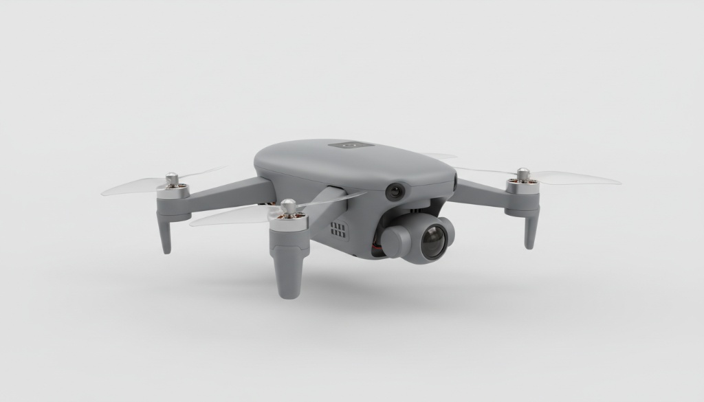
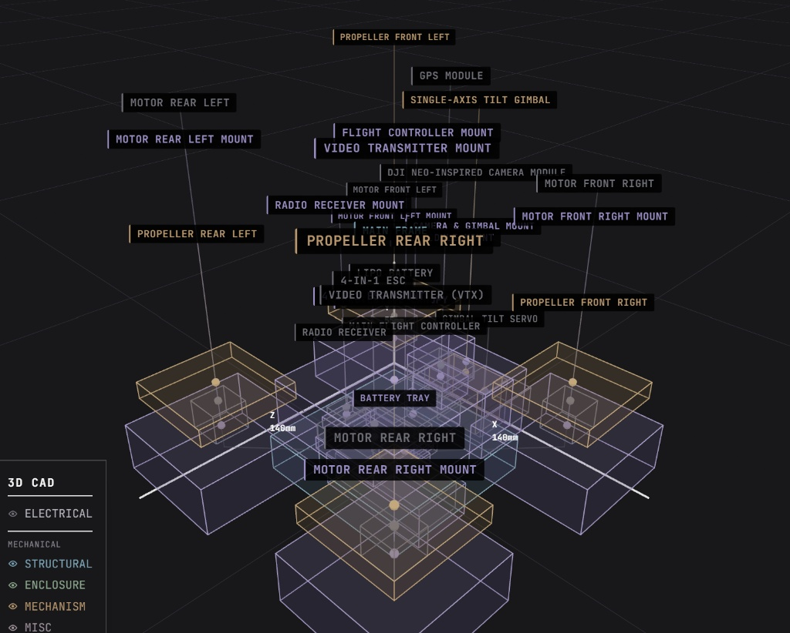
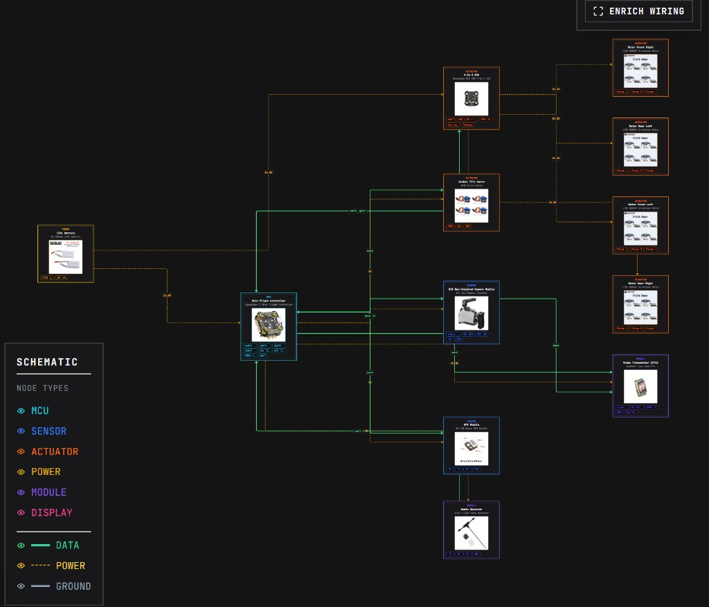
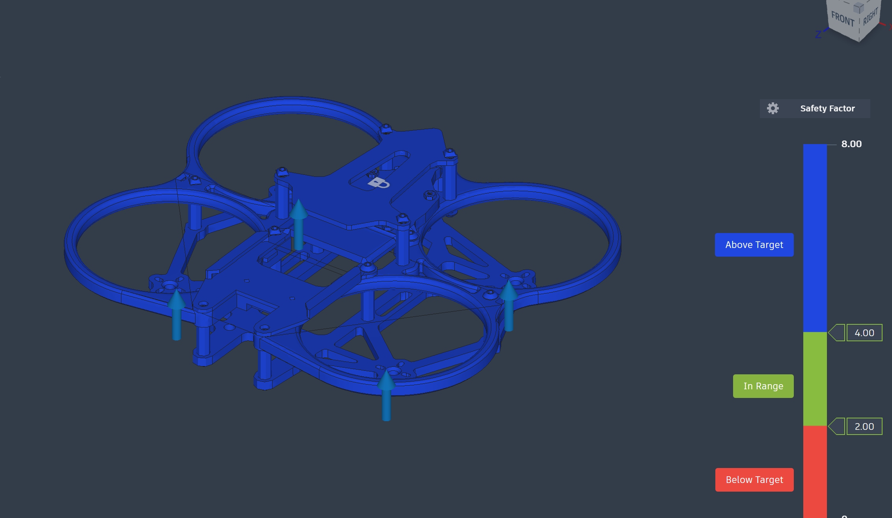

# Drone Tracker

A palm-sized mini quadcopter that tracks humans and records 4K video — built around a SpeedyBee F7 Mini flight controller, GPS navigation, and a DJI Neo-inspired camera on a single-axis tilt gimbal.




## Overview

**Drone Tracker** is a compact autonomous-tracking UAV platform. The airframe spans roughly **140 mm**, making it genuinely palm-sized while still carrying a full FPV stack, GPS module, and a gimbal-stabilized 4K camera.

The platform is designed for:

- **Human tracking** — GPS-assisted follow and position hold
- **4K video capture** — DJI Neo-inspired camera module with analog FPV feed
- **Dynamic framing** — single-axis tilt gimbal (SG90 servo) for pitch adjustment in flight
- **Manual + autonomous flight** — ELRS radio control with Betaflight firmware

## Key Specs

| Spec | Value |
|------|-------|
| Frame size | ~140 mm (palm-sized) |
| Motors | 4× 1103 8000KV brushless |
| ESC | SpeedyBee BLS 35A 4-in-1 |
| Flight controller | SpeedyBee F7 Mini |
| Battery | 2S 350 mAh LiPo (14.8 V) |
| GPS | Be-180 Micro GPS |
| Camera | DJI Neo-inspired 1/2.3" CMOS, 4K |
| Gimbal | Single-axis tilt (SG90 servo) |
| Radio | ELRS 2.4 GHz Nano Receiver |
| VTX | RushFPV Tiny Tank |
| Firmware | Betaflight |
| Total parts | 33 (12 electrical + 21 mechanical) |
| Estimated BOM cost | **$412.83** |

## Design

### 3D CAD — Exploded View



The mechanical stack includes 3D-printed mounts for every subsystem — flight controller, ESC, GPS, radio, VTX, motors, camera/gimbal, battery tray, and a protective canopy. See [docs/parts-list.md](docs/parts-list.md) for the full bill of materials.

### Wiring Diagram



Central hub is the **SpeedyBee F7 Mini**. Power flows from a 2S LiPo through the 4-in-1 ESC to the motors; the FC distributes 5 V to peripherals over UART, I2C, and PWM. Full pin assignments are in [docs/wiring.md](docs/wiring.md).

## Structural FEA Analysis

Static-stress finite-element analysis of the **CINEC 25.1.2 cinewhoop airframe** (3D-printed ABS) in **Autodesk Fusion (Simulation)**, validating that the printed frame survives full-thrust loading. Full write-up, methodology, and high-resolution plots are in **[`structural-analysis/`](structural-analysis/)**.



| Result — 400 g total thrust (4 × 0.98 N) | Value |
|---|---|
| Minimum Safety Factor (ABS yield) | **10.2** — "Very strong" |
| Maximum von Mises stress | **1.96 MPa** |
| Maximum displacement | **1.18 mm** |
| Weakest zones | prop-guard spokes, duct-to-frame junctions |

**Method:** structural-parts-only model (non-load-bearing electronics removed), ABS material, *Fixed* constraint on the central top deck, four upward 0.98 N thrust loads at the motor bells, bonded automatic contacts, ~1.9 M-element tetrahedral mesh, solved locally. A frame-only baseline (Simulation Model 1) returned SF ≈ 0.57 — showing that the **ducts and prop guards act as primary load-sharing members**, not just protection.

→ **[Read the full structural analysis](structural-analysis/README.md)**

## Architecture

```
┌─────────────┐     UART2      ┌──────────┐
│  GPS Module │◄──────────────►│          │
└─────────────┘                │          │     PWM      ┌─────────┐
┌─────────────┐     UART3      │ SpeedyBee│────────────►│ 4-in-1  │──► Motors ×4
│ ELRS Radio  │◄──────────────►│ F7 Mini  │             │   ESC   │
└─────────────┘                │    FC    │     PWM5     └─────────┘
┌─────────────┐     I2C        │          │────────────► Gimbal Servo
│   Camera    │◄──────────────►│          │
└──────┬──────┘                │          │     UART4
       │ video                 └────┬─────┘────────────► VTX
       └────────────────────────────┘
```

1. **Sense** — IMU + barometer (onboard FC), GPS fix, camera feed
2. **Estimate** — Betaflight sensor fusion for attitude and position
3. **Control** — PID stabilization + position hold via GPS
4. **Track** — follow-target logic using GPS and visual cues (planned)
5. **Capture** — 4K recording with gimbal tilt for dynamic framing

## Build Guide

| Phase | Description | Doc |
|-------|-------------|-----|
| 1. Fabricate | 3D print mounts, test-fit all parts | [assembly.md](docs/assembly.md#phase-1--fabricate) |
| 2. Wire | Solder power, motor, UART, I2C, PWM | [wiring.md](docs/wiring.md) |
| 3. Bring-up | Continuity checks, flash Betaflight, calibrate | [assembly.md](docs/assembly.md#phase-3--bring-up) |
| 4. Assemble | Mount electronics, route wires, install canopy | [assembly.md](docs/assembly.md#phase-4--assemble) |

### Tools

3D printer (PETG/PLA/TPU) · soldering iron · multimeter · wire strippers · M1.2/M2 drivers · LiPo charger · zip ties

## Repository Layout

```
autonomous-drone/
├── docs/
│   ├── images/
│   │   ├── drone-render.png        # product render
│   │   ├── wiring-diagram.png      # electrical schematic
│   │   └── cad-exploded-view.png   # 3D CAD exploded view
│   ├── parts-list.md               # full BOM (33 parts)
│   ├── wiring.md                   # pin map and connections
│   └── assembly.md                 # step-by-step build instructions
├── structural-analysis/            # FEA of the CINEC 25.1.2 frame
│   ├── README.md                   # full analysis write-up
│   ├── images/
│   │   ├── cad-assembly-iso.png    # CAD assembly, isometric view
│   │   ├── cad-assembly-top.png    # CAD assembly, top view
│   │   ├── cad-assembly-bottom.png # CAD assembly, bottom view
│   │   ├── fea-safety-factor.png   # Safety Factor plot
│   │   └── fea-von-mises-stress.png# von Mises stress plot
│   └── cinec-25-drone-model.stl    # 3D mesh of the drone
├── src/                             # flight firmware / tracking logic (planned)
└── README.md
```

## Roadmap

- [x] Frame and component selection
- [x] 3D CAD layout and wiring design
- [x] Parts list and assembly documentation
- [x] Structural FEA validation of the frame (min SF ≈ 10.2)
- [ ] 3D print and mechanical assembly
- [ ] Electrical bring-up and Betaflight tuning
- [ ] GPS waypoint navigation
- [ ] Human-tracking follow mode
- [ ] 4K video recording pipeline
- [ ] Field test + demo video

## Status

**Design + documentation complete** — mechanical CAD, wiring schematic, BOM, structural FEA, and bring-up procedures are documented. Hardware build and firmware development are next.

## License

MIT — see [LICENSE](LICENSE).

## Contact

Bhavya Dosi — [LinkedIn](https://www.linkedin.com/in/bhavya-dosi)
