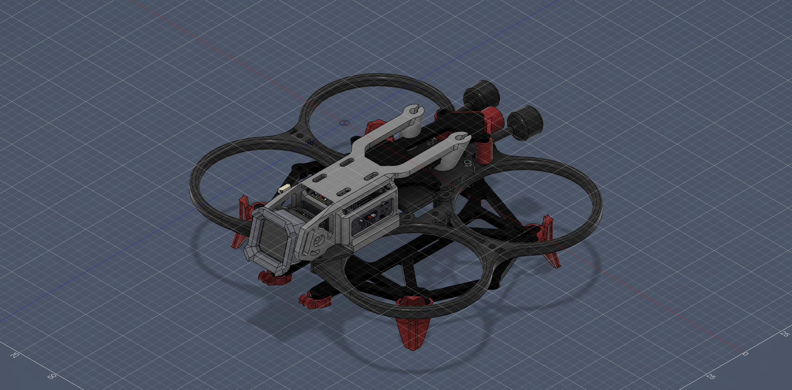
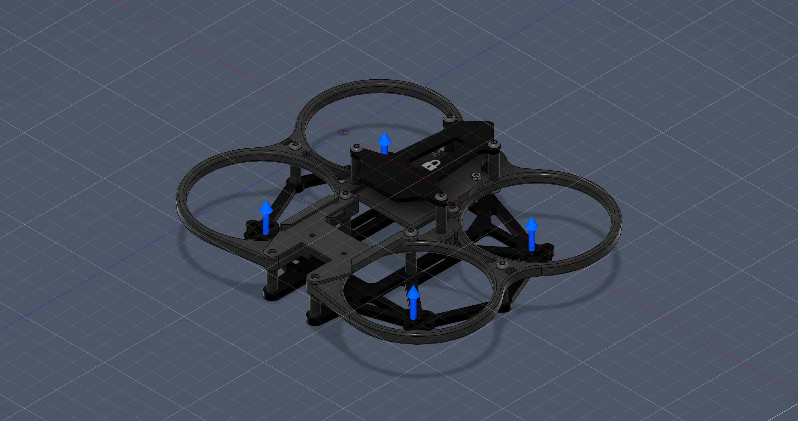

# CINEC 25.1.2 — Cinewhoop FPV Drone Frame · Structural FEA

Static-stress finite-element analysis of a 3D-printed **ABS ducted "cinewhoop" FPV drone frame**, performed in **Autodesk Fusion (Simulation)**. The study validates that the load-bearing structure survives full-thrust loading with margin, and identifies the highest-stress regions of the airframe.

---

## Overview

| | |
|---|---|
| **Airframe** | CINEC 25.1.2 — ducted cinewhoop, 4-motor |
| **Analysis type** | Linear static structural (Static Stress) |
| **Tool** | Autodesk Fusion — Simulation workspace |
| **Material** | ABS plastic (FDM), all structural parts |
| **Load case** | 400 g total thrust (4 × 100 g), motors at full pull |
| **Result** | Min. Safety Factor **10.2** · Max von Mises **1.96 MPa** · Max deflection **1.18 mm** |

The full CAD assembly (above) includes the frame, ducts and prop guards, standoffs, top deck, four XING2 1404 motors, an AIO flight controller, an ELRS receiver, camera, battery and capacitor. For the structural analysis, only the **load-bearing parts** were retained (see methodology).

---

## Objective

Confirm that the printed ABS airframe can carry the thrust produced by its four motors without yielding, and locate the weakest regions so the design can be reinforced or lightened intelligently.

---

## Methodology

### Model preparation
The complete design contains ~1,600 bodies. Bonded-contact FEA cannot connect free-floating electronics and fasteners, so the full assembly produced ~1,596 unconstrained groups and would not solve. The model was therefore reduced to **structural parts only**:

- **Kept:** central frame, ducts, prop guards, standoffs, top deck plate.
- **Removed:** motors, screws, battery, capacitor, receiver, and AIO electronics (non-structural, cannot be bonded).

One electronics body (the AIO flight-controller board) contained corrupted geometry that caused surface-meshing errors and was excluded with **Simplify → Remove**.

### Boundary conditions
- **Material:** ABS Plastic applied to every body (yield strength ≈ 20 MPa).
- **Constraint:** *Fixed* support on the central top deck plate (the mounting interface to the payload/stack).
- **Loads:** `0.98 N` (100 g) applied **upward (+Y)** at each of the **four motor-mount bell edges** → **400 g total thrust** (Force-Per-Entity). This represents roughly 2× hover thrust for a ~200 g all-up-weight micro craft — a conservative, aggressive-maneuver load.
- **Gravity:** suppressed, to isolate the structural response to thrust.
- **Contacts:** automatic bonded contacts at 2 mm tolerance.

### Mesh
- Solid tetrahedral mesh, **12 mm** absolute average element size (coarsened from the default to clear surface-meshing *geometry errors* around the center standoffs/deck).
- Solver mesh ≈ **1.91 M nodes / 1.33 M elements**.
- **"Remove rigid body modes"** enabled in the solver to stabilize a handful of disconnected non-load-bearing hardware bodies (otherwise the model is reported as statically unstable). This adds weak springs only to otherwise-free parts and does not affect the stress in the connected load path.

Solved locally (static solve — no cloud credits).

---

## Results

**Simulation Model 2 — full structural assembly**

| Quantity | Value |
|---|---|
| Minimum Safety Factor (yield) | **10.23** — "Very strong" |
| Maximum von Mises stress | **1.955 MPa** |
| Maximum total displacement | **1.183 mm** |
| Solver | Local static, ABS, bonded contacts |

### Safety Factor
Entire structure is above the 4.0 target (whole model blue). Minimum SF ≈ 10.2 means the airframe carries ~10× its full-thrust load before reaching the ABS yield point.

### Von Mises Stress
Peak stress **1.96 MPa**, far below the ~20 MPa ABS yield. Elevated stress (cyan/green) concentrates on the **prop-guard spoke arms** and the **duct-to-frame / standoff junctions** — the members that transfer motor thrust into the central frame.

### Displacement
Peak deflection **1.18 mm**, at the **outer duct / prop-guard rings** (furthest from the fixed central deck). The core frame is essentially rigid; flex lives in the cantilevered duct rings.

---

## Interpretation

**Weakest zones**
1. Prop-guard spoke arms (thin X-struts inside each duct).
2. Duct-to-frame and standoff junctions near the center.
3. Outer duct rings — highest deflection, though low stress.

The load path is intact and continuous: thrust at the motor bells → through the ducts and spokes → into the central frame → reacted at the fixed top deck. Stress is low and well distributed, so the airframe is **over-built for this load case** — there is room to lighten the ducts/guards if mass reduction is a goal.

**Frame-only vs. full-structure (Model 1 vs. Model 2)**

An earlier study on the **bare central frame arms alone** (Simulation Model 1) returned a minimum Safety Factor of **≈ 0.571** — i.e. localized yielding under the same 400 g thrust. When the **full bonded structure** (ducts + prop guards + standoffs + deck, this study, Model 2) shares the load, the min SF rises to **≈ 10.2**.

The two numbers bracket the design:
- **0.571** — worst-case lower bound if the slim frame arms had to carry thrust in isolation.
- **10.2** — realistic behavior of the fully-assembled ducted structure, where many redundant paths carry the load.

This is the key structural insight: the **ducts and prop guards are not just cosmetic/protective — they are primary load-sharing members** that make the airframe stiff.

---

## Assumptions & limitations

- **Linear static** analysis (small deflection, linear-elastic ABS) — no impact, fatigue, vibration, or modal/resonance analysis.
- FDM parts are **anisotropic**; this model treats ABS as isotropic with bulk properties, so layer-adhesion weakness (Z-direction) is not captured.
- **Bonded** contacts assume glued/press-fit interfaces; real bolted joints may behave differently.
- Static 2× hover thrust load only — real flight adds gyroscopic, gust and crash loads.
- "Remove rigid body modes" stabilizes minor disconnected hardware; results are valid for the connected load-bearing structure.

---

## Repository contents

| File | Description |
|---|---|
| `drone-cad-model.png` | Full CINEC 25.1.2 CAD assembly (render) |
| `fea-safety-factor.png` | FEA — Safety Factor plot |
| `fea-von-mises-stress.png` | FEA — von Mises stress plot |
| `fea-displacement.png` | FEA — total displacement plot |
| `cinec-25-drone-model.stl` | 3D mesh of the full drone (mm) |
| `README.md` | This report |

---

## Tools

Autodesk Fusion (Design + Simulation) · Linear static FEA · ABS (FDM) material model

*Analysis and documentation for the CINEC 25.1.2 cinewhoop airframe.*
